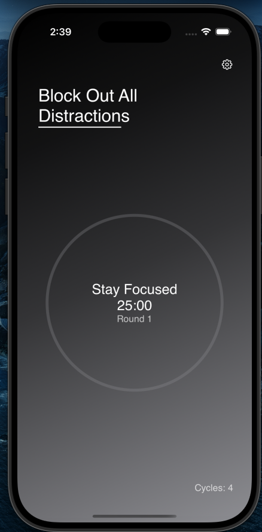

# pocus-app
This productivity app helps manage digital distractions by enabling users to lock distracting mobile apps for set periods. It features selective app locking, flexible timing, and Pomodoro Technique integration for enhanced focus and productivity, especially for students and professionals.

