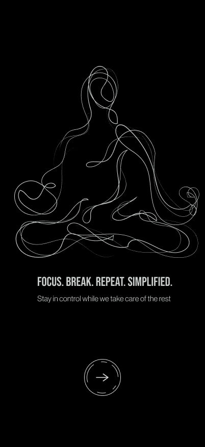
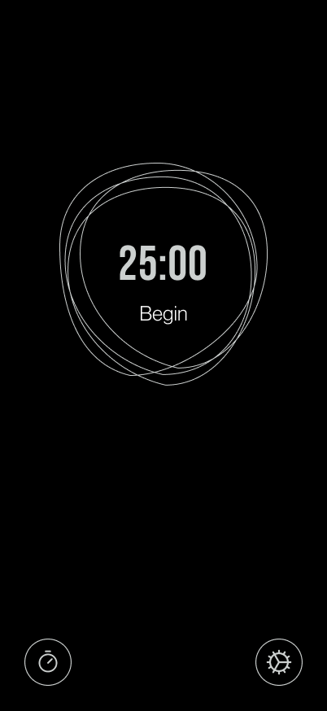

# GritLock

# 📱 Productivity App: Focus & Stay Distraction-Free

This productivity app helps users manage digital distractions by allowing them to lock distracting mobile apps for set periods. Designed for students and professionals, it promotes enhanced focus and productivity through key features:

---

## ✨ Key Features

- 🔒 **Selective App Locking:** Choose which apps to block and stay distraction-free.
- ⏲️ **Flexible Timing Options:** Set custom lock durations that suit your workflow.
- 🍅 **Pomodoro Technique Integration:** Boost focus with structured Pomodoro sessions, including breaks for optimal productivity.

---

## 🎯 Why Use This App?

Perfect for students balancing coursework and projects, or professionals managing tight deadlines. This app ensures uninterrupted work sessions, helping users build better focus habits and achieve their productivity goals.

---

## 📄 License

This project is licensed under the [MIT License](LICENSE).

  
  

